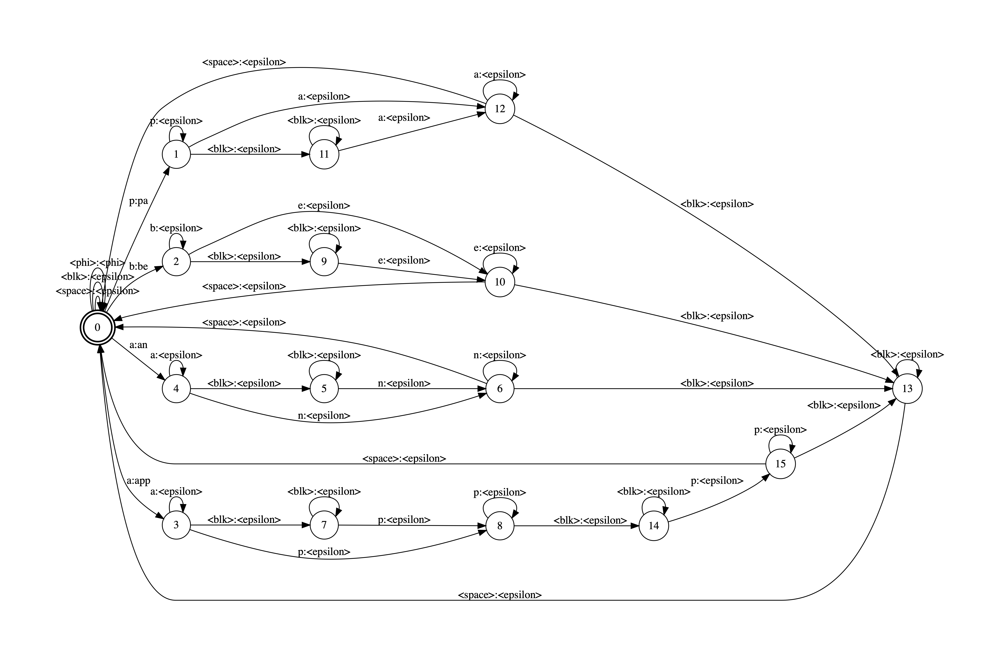

## TLG Compilation for CTC

Tokens graph maps CTC's output token to lexical character.

Lexical graph maps alphabet characters to words.

Composition of T and L graphs maps CTC's acoustic tokens to words.
We add `<phi>` self loop to be composed with G's backoff transitions

Grammar graph maps sequence of words to probability.
`<phi>` represents backoff  or failure transition.

Composition of TL and G graph maps CTC's acoustic tokens to ngram

